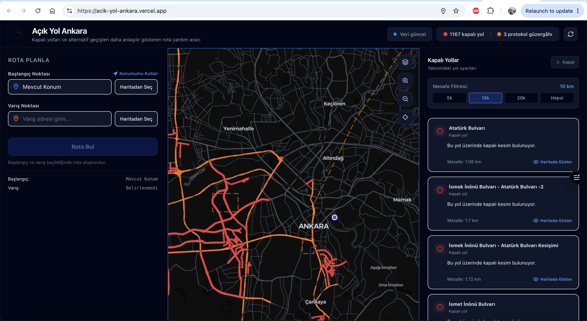
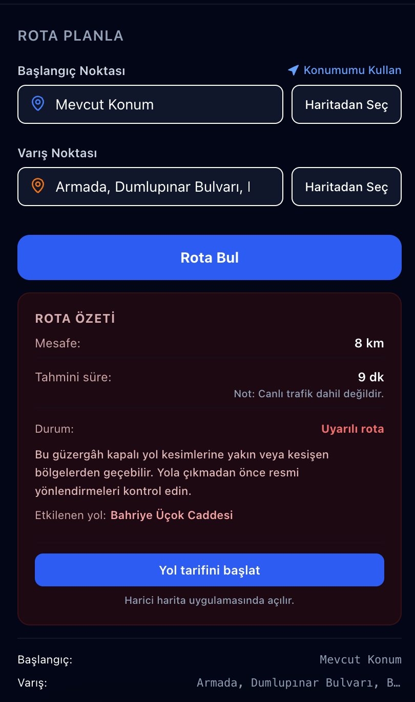
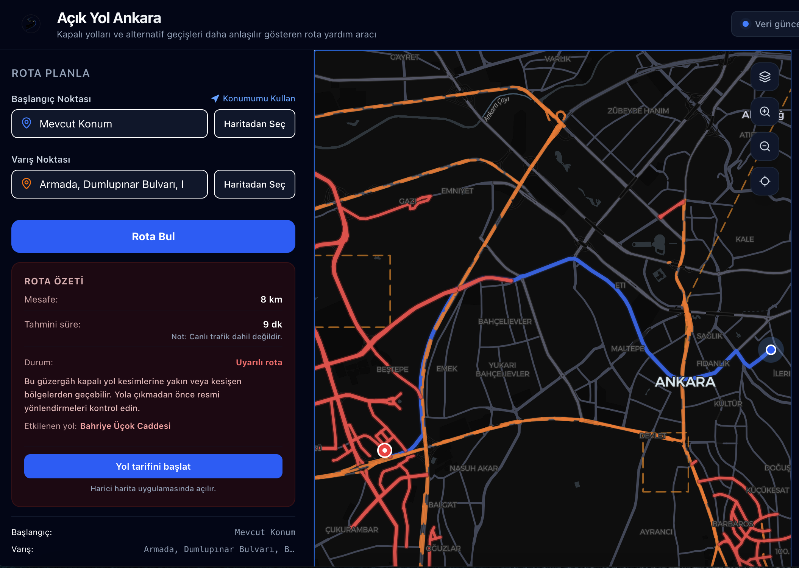

# Açık Yol Ankara

Açık Yol Ankara is a web-based map application developed for visualizing temporary road closures and protocol routes in Ankara during the NATO event week.

The project was created as an MVP to make event-based road restriction information easier to understand on a map. Users can select a starting point and a destination, generate a route, and receive a warning if the route passes near or intersects with affected road sections.

This is not an official traffic application and it is not intended to provide permanent, real-time traffic information for Ankara.

## Project Purpose

During large-scale events such as NATO-related meetings, summits, ceremonies, or official visits, some roads may be temporarily closed or reserved for protocol routes.

Road closure announcements can be difficult to interpret quickly, especially when users need to understand whether their route is affected.

The purpose of this project is to:

- visualize temporary road closures on an interactive map,
- show protocol / convoy routes separately,
- allow users to select start and destination points,
- generate a route between selected points,
- warn users if the route is close to affected road sections,
- present this information in a simple and mobile-friendly interface.

## Screenshots

### Desktop Overview

<p align="center">
  
</p>

### Route Planning

<p align="center">
  
</p>

### Route Result

<p align="center">
  
</p>

### Mobile View

<p align="center">
  
  
</p>

## Main Features

- Interactive map interface
- Temporary closed road visualization
- Protocol / convoy route visualization
- Current location support
- Start and destination selection
- Address and place search
- Point selection directly from the map
- Route generation between selected points
- Route summary with distance and estimated duration
- Warning message if the route is close to affected roads
- Nearby road warning list
- Mobile-friendly layout

## Technologies Used

- Next.js
- TypeScript
- Tailwind CSS
- MapLibre GL
- Turf.js
- OpenStreetMap-based geocoding services
- OSRM routing service
- GeoJSON road data

## Geospatial Approach

The project includes several WebGIS and geomatics-related concepts:

- rendering GeoJSON road data on a web map,
- styling different road restriction categories,
- working with coordinates in [longitude, latitude] format,
- selecting points directly from the map,
- geocoding addresses and places,
- generating routes between coordinates,
- checking whether a route is close to affected road sections.

## Data and Limitations

The application uses GeoJSON-based road restriction data and OpenStreetMap-based services for address search and routing.

Important limitations:

- The project was designed for temporary NATO event week restrictions.
- Route duration does not include live traffic data.
- The application does not provide official navigation guidance.
- Road restriction data may become outdated after the event period.
- Official announcements and traffic directions should always be followed.

## Installation

Clone the repository:

```bash
git clone https://github.com/zeyzey28/acik-yol-ankara.git
cd acik-yol-ankara
npm install
npm run dev
```
