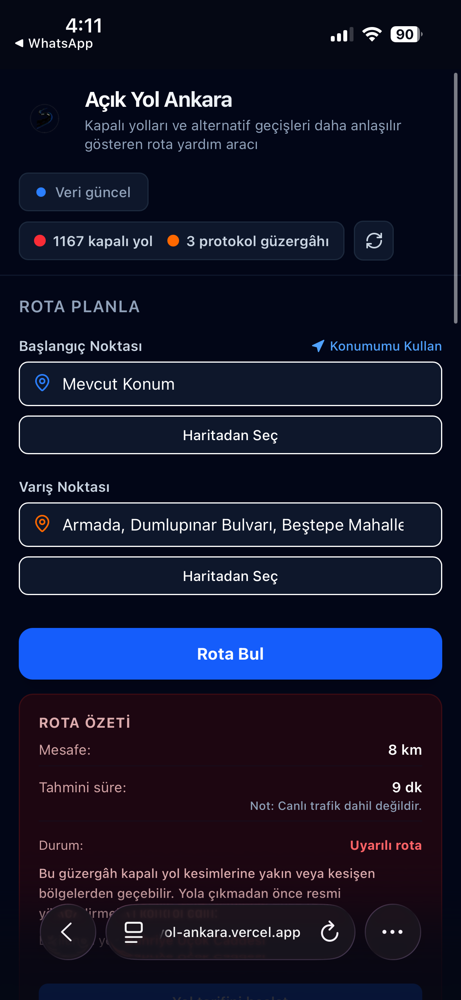
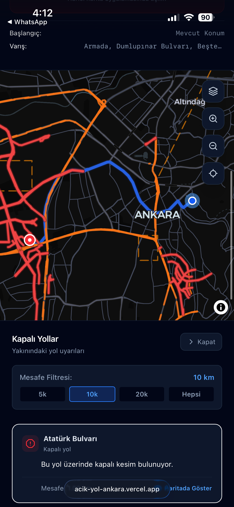

# Açık Yol Ankara

Açık Yol Ankara is a web-based map application developed to make temporary road closures, protocol routes, and route-related warnings in Ankara easier to understand on a map interface.

The project focuses on combining geospatial data visualization, route planning, and user-friendly warning messages. Users can select a starting point and a destination, generate a route, and see whether the suggested route is close to or affected by temporary road restrictions.

This project was developed as an MVP and portfolio project, not as an official traffic/navigation service.

## Project Purpose

During major events, summits, ceremonies, or temporary traffic restrictions, road closure information is often published in a way that is difficult for regular users to interpret quickly.

The purpose of Açık Yol Ankara is to:

- visualize closed roads on an interactive map,
- show protocol and convoy routes separately,
- allow users to create a route between two points,
- warn users if the route is close to affected road sections,
- present this information in a simple mobile-friendly interface.

## Screenshots





## Main Features

### Interactive Map

The application displays Ankara-based road restriction data on an interactive map. Closed roads and protocol/convoy routes are shown with different visual styles so users can distinguish them easily.

### Route Planning

Users can select:

- a starting point,
- a destination point,
- their current location,
- or a point directly from the map.

After selecting both points, the application generates a route and displays it on the map.

### Route Warning System

After a route is created, the application checks whether the route is close to or intersects with affected road sections.

Depending on the situation, the user may see messages such as:

- the route appears suitable,
- the route may pass near affected roads,
- the route should be checked carefully before travelling.

### Address and Place Search

Users can search for addresses and places such as:

- streets,
- districts,
- cafes,
- shopping malls,
- hospitals,
- pharmacies,
- schools,
- metro stations,
- bus stops,
- public places.

The search is focused on Ankara and uses OpenStreetMap-based services.

### Mobile-Friendly Layout

The interface is designed to work on both desktop and mobile screens. On mobile devices, the route planning panel, map, route result, and road warning list are arranged in a more readable layout.

## Technologies Used

- Next.js
- TypeScript
- Tailwind CSS
- MapLibre GL
- Turf.js
- OpenStreetMap-based geocoding services
- OSRM routing service
- GeoJSON road data

## Geospatial Side of the Project

This project includes several geospatial concepts:

- displaying GeoJSON line data on a web map,
- styling road closure and protocol route layers,
- using coordinates in `[longitude, latitude]` format,
- selecting points from the map,
- geocoding addresses and places,
- calculating routes between two coordinates,
- checking route proximity to affected road sections.

The project is especially relevant for geomatics, WebGIS, urban mobility, and map-based decision support systems.

## Data Sources

The application uses GeoJSON-based road data to display road closures and protocol/convoy routes.

Address and place search is based on OpenStreetMap-related geocoding services.

Route generation is handled through an OSRM-based routing service.

Important note:

The estimated route duration does not include live traffic data. Official traffic announcements, police directions, and authorized institution updates should always be followed.

## Installation

Clone the repository:

```bash
git clone https://github.com/zeyzey28/acik-yol-ankara.git
cd acik-yol-ankara
npm install
npm run dev
```
